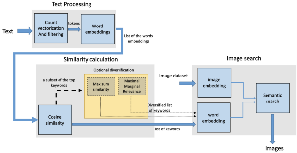

# Text-Based Image Search Engine

This tool aims to assist writers or bloggers who often write articles, texts, or stories without accompanying illustrations or cover images. Many websites and newspapers require relevant images to be provided for each article, aligning with the webpage or magazine design template.

## Project Scope

Writers and bloggers frequently encounter situations where they lack appropriate visuals for their written content. This tool aims to address this issue by automatically generating images based on the text's context and keywords. By utilizing the extracted keywords, the tool will display relevant photos that can enhance the overall visual presentation of the article.

## Project Specifications

The solution involves a multi-step process to achieve the desired functionality:

1. Preprocessing the Text: The input text goes through a preprocessing step to prepare it for further analysis and keyword extraction.

2. Extracting Important Words: The tool extracts a set of the most important words or keywords from the preprocessed text.

3. Keyword-Based Image Extraction: Using the extracted keywords, the tool searches for and extracts a set of images related to those keywords.

## Solution Workflow

The workflow of the solution involves the following steps:

1. Input Text: Provide the text (article, blog post) for which images are required.

2. Text Preprocessing: The tool processes the input text using count vectorization techniques to generate keyword candidates.

3. Filtering and Word Embeddings: The keyword candidates undergo filtering and word embedding processes to obtain embeddings representing the significance of each keyword.

4. Similarity Calculation and Diversity: The tool calculates the similarity between the keywords and introduces diversity to ensure a comprehensive and relevant set of keywords.

5. Relevant Image Selection: Using the most relevant keywords, the tool compares the embeddings with the images' embeddings in the database. This process identifies the most semantically relevant images for the inputted text.

By employing this text-based image search engine, writers and bloggers can effortlessly obtain relevant and contextual images to accompany their written content, ensuring a visually appealing presentation and improved user experience.

